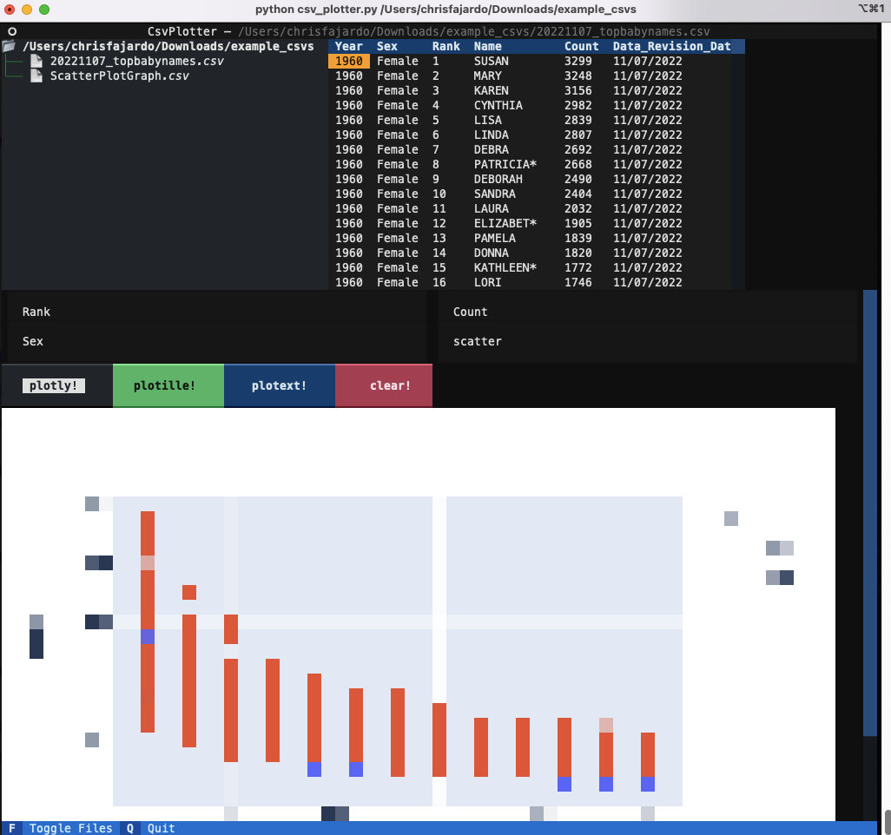

# HackathonJan2023

Make a Terminal UI application for plotting data from CSVs.

## Run
- Create a python environment and `pip install -r requirements.txt`
- Run `python csv_plotter.py <root_directory>`

## About

- Mainly explored the capabilities of [Textual](https://textual.textualize.io)
  - Used capabilities
    - Directory tree
    - Data tables
    - Buttons
    - Key Bindings
    - AutoComplete for inputs [textual-autocomplete](https://github.com/darrenburns/textual-autocomplete)
    - RichPixels for showing images [rich-pixels](https://github.com/darrenburns/rich-pixels)
    - Error tracebacks from Rich
- Tried various plotting methods to make plots, but all fail
  - [PlotlyExpress](https://plotly.com/graphing-libraries/)
    - Generate plot image file first, then render the image. Can use this method for any plotting library.
    - **Pro:** Most compatible with Textual.
    - **Con:** RichPixels is only for very low res (1 char = 1 pixel)
      - **Future:** try [SIXEL](https://github.com/saitoha/libsixel)
  - [plotext](https://github.com/piccolomo/plotext)
    - **Pro:** Most fully featured plotter
    - **Con:** Incompatible rendering with Textual
  - [plotille](https://github.com/tammoippen/plotille)
    - **Con:** Incompatible rendering with Textual
- **Future:** try adding a loading screen using these Textual capabilities
    - Screens
    - Animation
